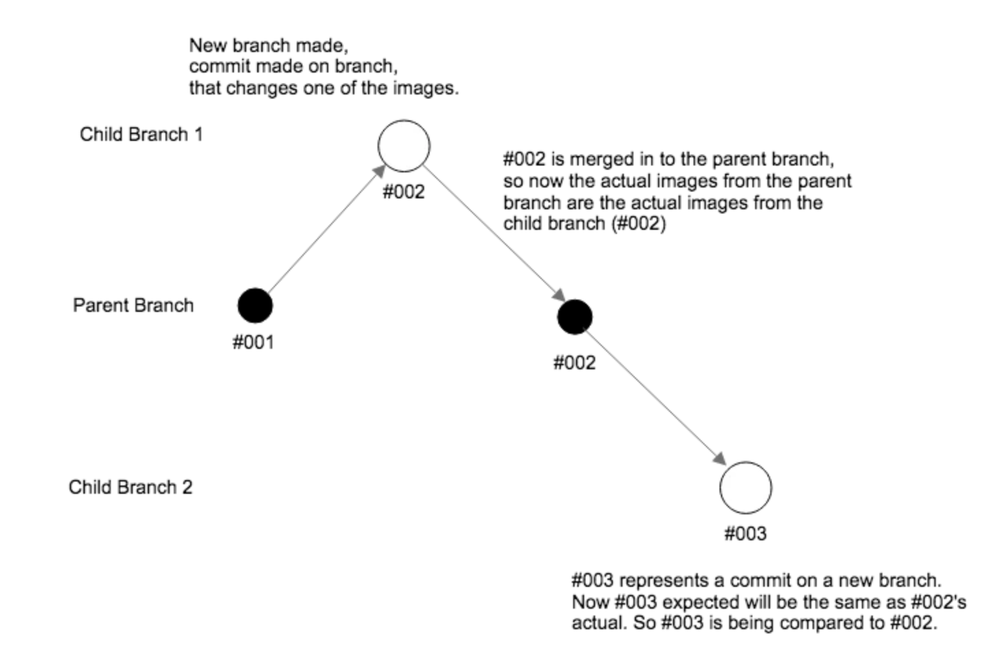
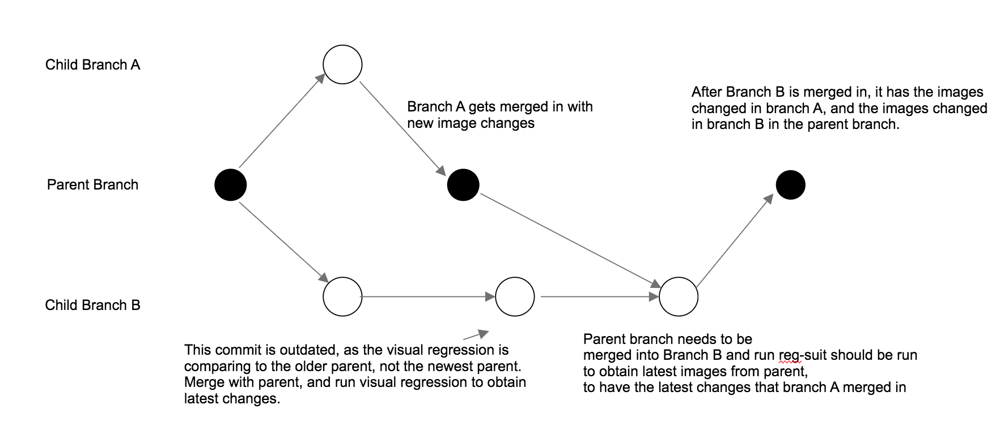

#Mobile Visual Regression
### How the Git-Hash Plug-In Works

The git hash plug-in is an add-on to Reg-Suit that names snapshot keys (another way of saying set of reference images) according to the git commit hash. So if you ran the visual regression on commit `123abc`, the snapshot key's name would be `123abc`. Reg-Suit works well with the S3 plugin, which allows the snapshot keys to be uploaded to a folder in S3 named after the commit hash/snapshot key.

**Things to know:**

- A snapshot key is the set of reference images/expected images generated by the command `reg-suit run`.
- Running reg-suit will create a new snapshot key and upload files to S3
- A snapshot key folder on S3 contains expected images, actual images, and the HTML report
- When a branch is made, an initial commit must be made to generate the new snapshot key
- *Important*: when a branch is made, `reg-suit run` will compare the child branch's **actual** images to the parent branch's **actual** images. 
- **The child branch's *expected* images are the *actual* images of the parent branch**
- `reg-suit run` will fetch the *expected* images from S3 (downloading them locally), compare the images and generate *diff* images, and upload the locally generated *diff* images and report to the S3 bucket in a folder named after the commit hash

> When a child branch is made, it is always being compared to the parent branch.

> The images are **not** literally moved from one S3 folder to another, they are simply updated references to the S3 folder according to the merged commit hash

### Merging and Pulling
- **When you run reg-suit run after a change, it will always be comparing it to the parent directory, so it will always fail if a visual change is present (even if the visual change is desired)**
- **If the parent branch is updated, the child branch must merge the parent branch into the child branch to update the snapshot key it compares to (changes the reference images)**

> This flow shows how child branches should update their current images with whatever is on the parent branch by merging with the parent branch

- Whether images have been deleted, modified or added, the new branch will have them, when `reg-suit run` is executed, because the code has been merged into the branch