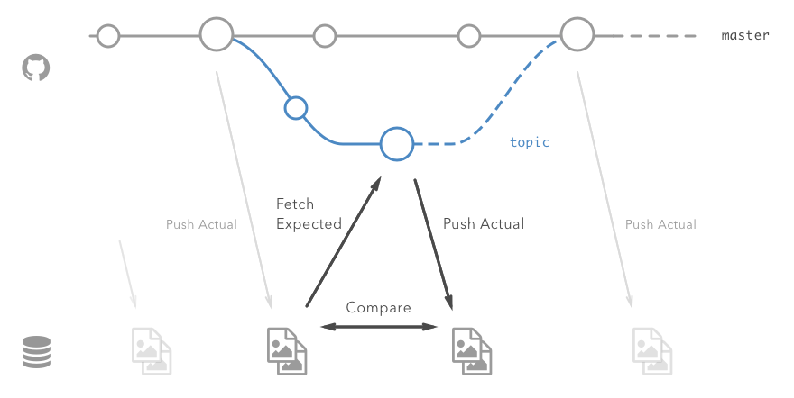
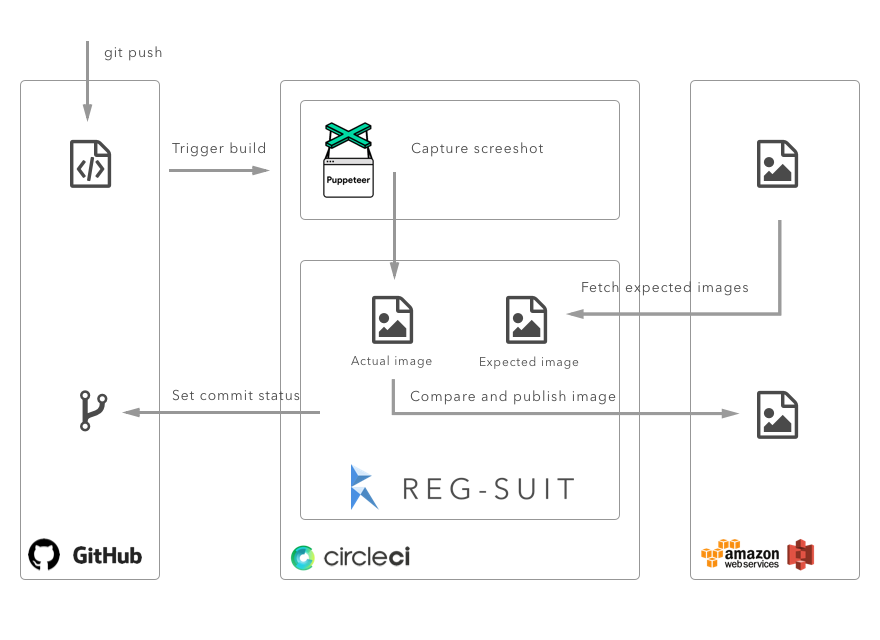

#Mobile Visual Regression
### Initial Reg-Suit Set-Up for Continuous Integration (CI)

>See Reg-Suit repository for more details about what Reg-Suit is: <https://github.com/reg-viz/reg-suit>


**CI** Installation Procedure:

1. Add **S3 private key and access key** to build secrets in Bitrise (you can get them from the IAM account that has been given access to the bucket)
2. For iOS, the shell script should look like:

	```sh
	pod install
	bundle install
	bundle exec fastlane snapshot
	cd visual_regression
	npm install -g reg-suit
	npm install -D reg-suit
	reg-suit run
	```
	
	
	
	
